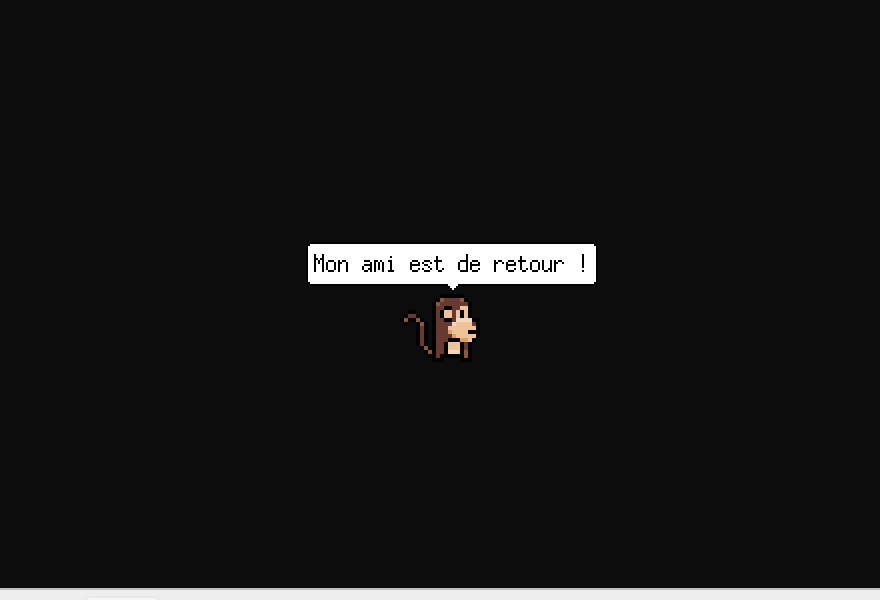
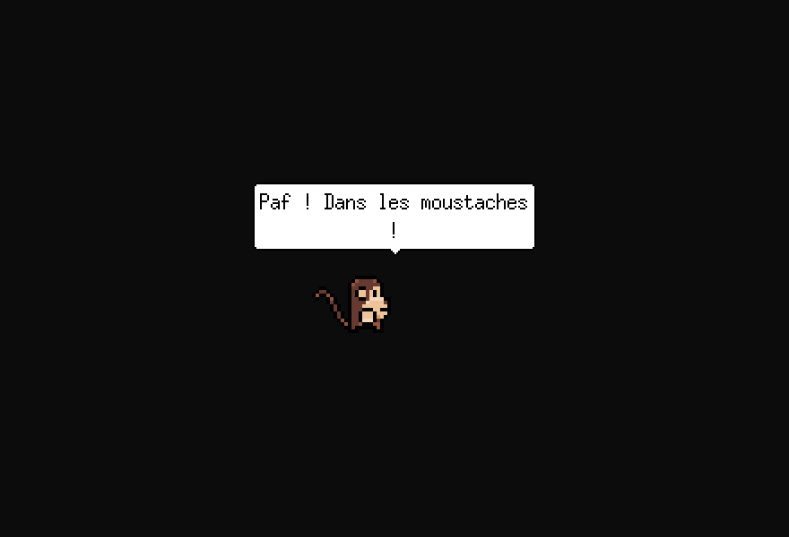
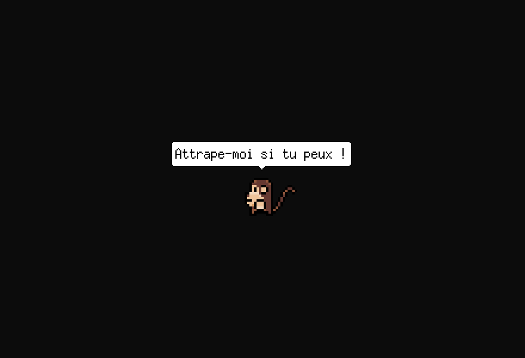
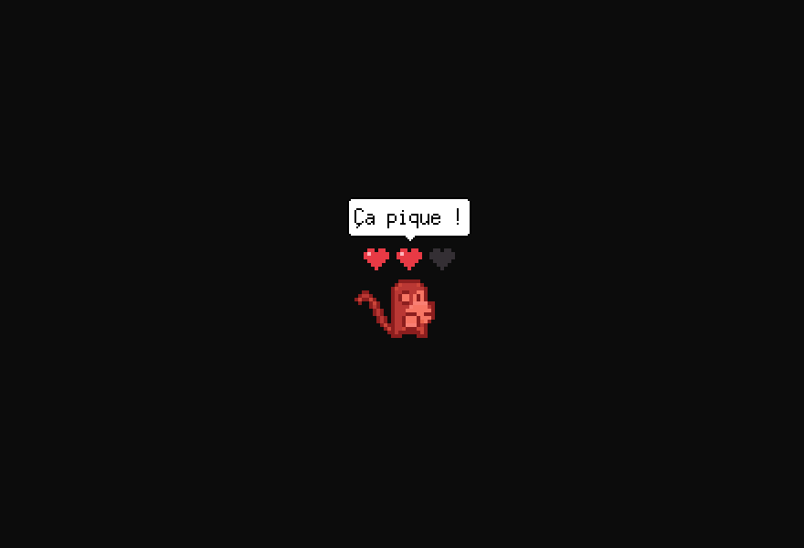
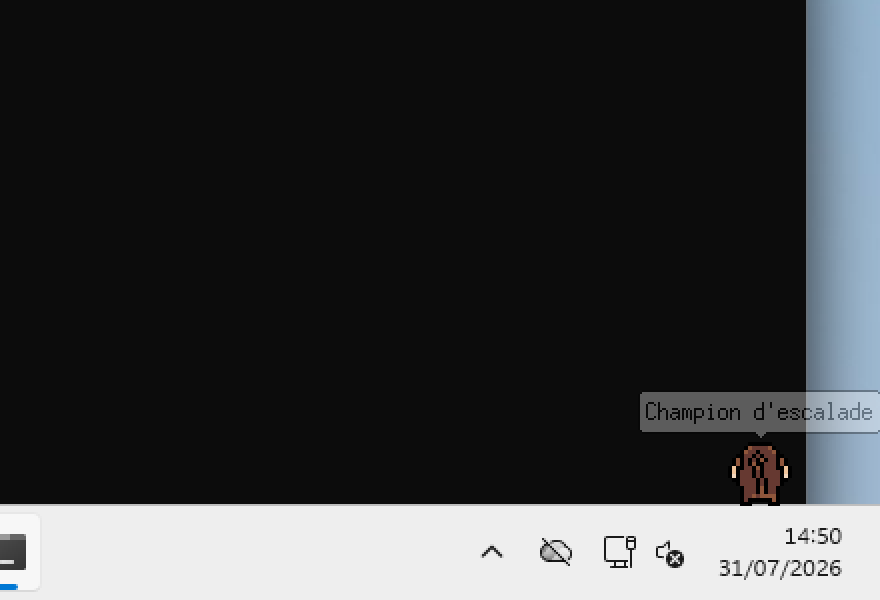
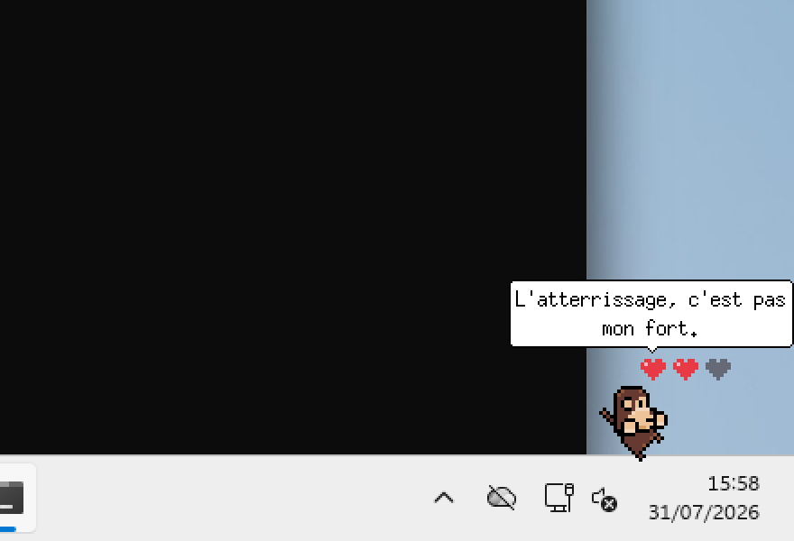
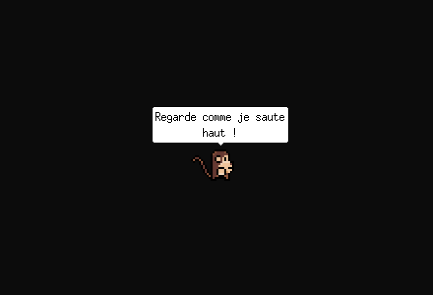
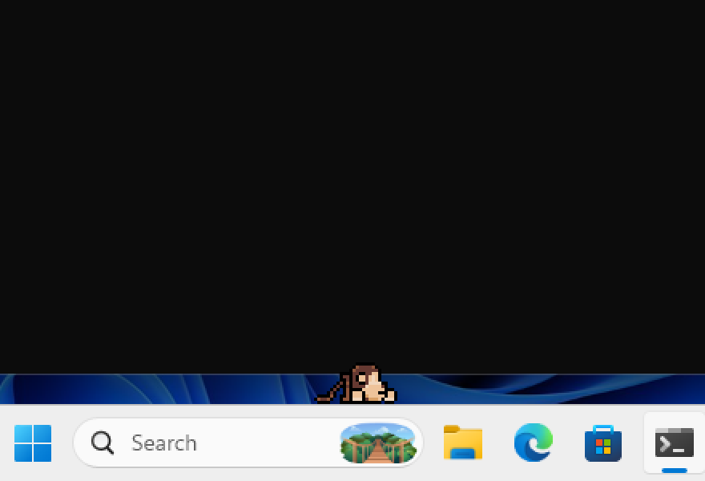
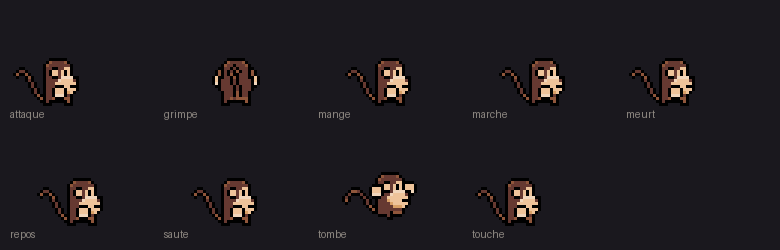

<div align="center">

# 🐒 Singe de bureau

**Une petite mascotte pixel art qui vit sur ton bureau Windows.**



*Un seul fichier `.exe`, aucune installation, aucune dépendance.*

</div>

---

Le curseur est **son meilleur ami** : tant qu'il bouge de temps en temps, le
singe passe l'essentiel de son temps à le rejoindre et le suivre partout — et
quand tu reprends la souris après une longue pause, il accourt. Parfois
l'amitié tourne au jeu : il prend la flèche en chasse pour l'attaquer, et ses
coups de patte la repoussent pour de vrai ; il lui arrive même de **voler le
curseur** et de s'enfuir avec, avant de le rendre en arrivant au bout — ou dès
que tu secoues la souris pour te débattre.

Quand la souris ne bouge plus pendant un moment, il vit sa vie : il se
promène, mange, bondit, escalade les bords de l'écran avant de se laisser
tomber, finit par faire la sieste, et dit un mot de temps en temps.

## Ce qu'il sait faire

| | |
|:---:|:---:|
| <br>**Chasser la flèche** et l'attaquer à coups de banane — chaque coup la repousse | <br>**Voler le curseur** et s'enfuir avec, jusqu'à ce que tu te débattes |
| <br>**Encaisser tes clics** : trois cœurs, flash de dégâts, et des protestations | <br>**Escalader les bords** de l'écran, souffler en haut, se laisser tomber |
| <br>**Rater ses réceptions** — la chute coûte un cœur, il ne grimpe plus quand il n'en a qu'un | <br>**Bondir partout** en vraies paraboles, avec rebond sur les bords |
| <br>**Mourir pour de bon** : le corps tombe et reste étendu sur la barre des tâches | <br>**T'accueillir en fanfare** dès que ta souris revient à la vie |

Et le reste se découvre à l'usage : la sieste quand on l'ignore, le réveil en
sursaut, les bulles selon l'heure de la journée, la peur après une
résurrection…

### Le tuer, le ranimer

Trois clics et c'est l'agonie : explosion de cœur, le corps tombe sur la barre
des tâches et y reste étendu. Tu peux le traîner à la souris — relâché, il
retombe. Pour le ranimer : **attrape-le et secoue-le franchement**. Le pouvoir
de l'amour fait le reste (mais il restera craintif un moment — ne t'approche
pas trop vite).

Un cœur perdu revient tout seul après 45 secondes de tranquillité.

## Installation

1. Télécharge `singe.exe` depuis les
   [Releases](https://github.com/my-monkeys/singe-de-bureau/releases).
2. Double-clique. C'est tout.

Pour l'arrêter : `Stop-Process -Name singe` dans un PowerShell (il n'a ni
fenêtre ni icône — il *vit* sur le bureau, c'est le principe).

### Démarrage automatique avec Windows

L'application doit tourner dans la session de l'utilisateur. Une tâche
planifiée à l'ouverture de session fait l'affaire :

```powershell
$a = New-ScheduledTaskAction -Execute "C:\Chemin\vers\singe.exe"
$p = New-ScheduledTaskPrincipal -UserId "$env:COMPUTERNAME\$env:USERNAME" -LogonType Interactive
$s = New-ScheduledTaskSettingsSet -AllowStartIfOnBatteries -DontStopIfGoingOnBatteries `
     -ExecutionTimeLimit ([TimeSpan]::Zero) -MultipleInstances IgnoreNew
$t = New-ScheduledTaskTrigger -AtLogOn -User "$env:COMPUTERNAME\$env:USERNAME"
$t.Delay = "PT25S"
Register-ScheduledTask -TaskName "Singe" -Action $a -Principal $p -Settings $s -Trigger $t
```

`-AllowStartIfOnBatteries` est indispensable sur un portable : sans lui,
Windows laisse la tâche en file d'attente et ne la démarre jamais.

## Personnalisation

Au premier lancement, un fichier de configuration est créé dans
`%APPDATA%\SingeDeBureau\config.json` :

- `chance_ami` : probabilité d'aller retrouver un curseur encore vivant à la
  fin d'une activité, quelle que soit la distance (défaut `0.85`).
- `secondes_avant_vie_seule` : immobilité de la souris au-delà de laquelle il
  la délaisse et vit sa vie (défaut `10`).
- `coeurs` : nombre de clics avant la mort (défaut `3`).
- `chance_chasse` : proportion des poursuites qui tournent à la chasse
  (défaut `0.35`). Il abandonne si la souris ne bouge plus.
- `chance_vol` : probabilité qu'une chasse au contact finisse en vol du
  curseur (défaut `0.35`).
- `chance_grimpe` : probabilité d'aller escalader un bord de l'écran
  (défaut `0.12`).
- `cache_apres_clic` : à `0` (défaut) le corps mort tombe sur la barre des
  tâches ; à une valeur positive, il disparaît ce nombre de secondes puis
  revient ailleurs.
- `secondes_avant_resurrection` : à une valeur positive, le cadavre resté au
  sol ce temps-là se relève tout seul (défaut `0` : seules les secousses le
  raniment).

Plus la vitesse, les distances, la fréquence des paroles, l'heure de la
sieste… tout est dans le fichier.

**Changer ce qu'il raconte** : dépose un `phrases.json` dans le même dossier —
il remplace les phrases embarquées, sans recompiler. Le format est le même que
[celui du recueil embarqué](internal/ressources/assets/phrases.json) : des
listes de phrases par contexte (`bonjour`, `touche`, `chasse`, `abandon`,
`retrouvailles`, `ranime`…).

### Changer de personnage



Les planches de sprites sont décrites par un fichier JSON, jamais en dur dans
le code. Pour un autre personnage, il suffit de déposer une image dans
`internal/ressources/assets/` et son descripteur à côté :

```json
{
  "image": "singe.png",
  "cellule": [48, 48],
  "echelle": 1.333,
  "vue": "dessus",
  "animations": {
    "marche_bas": {"cellules": [[0,0],[1,0],[2,0],[1,0]], "ms": 130},
    "repos_bas":  {"cellules": [[1,0]], "ms": 400}
  }
}
```

Les noms d'animation suivent la convention `action` ou `action_direction`
(directions `bas`, `gauche`, `droite`, `haut`). Actions reconnues : `repos`,
`marche`, `mange`, `dort`, `meurt`, `touche`, `attaque`, `saute`, `grimpe`,
`tombe` — **toutes facultatives**. Le comportement s'adapte à ce que la
planche propose : sans animation `mange`, le singe n'aura simplement jamais
faim ; sans `grimpe`, il restera au sol.

`vue` vaut `dessus` (quatre directions, style RPG Maker) ou `profil` (vue de
côté, gauche et droite seulement). `outils/composer_planche.py` normalise les
packs de sprites du commerce en une planche unique et génère le descripteur.

## Compiler

```bash
./build.sh windows     # produit dist/singe.exe
./build.sh mac         # produit dist/singe-mac
```

L'exécutable Windows se compile depuis n'importe quelle machine — aucun cgo.
Toutes les ressources (images, phrases) sont embarquées dans le binaire.

L'affichage sur le bureau n'est pour l'instant implémenté que sous Windows
(`internal/calque`). Le reste du programme est indépendant de la plateforme :
le portage macOS se limitera à une `NSWindow` à fond transparent et à la
lecture du curseur.

## Comment ça marche

L'application est une petite fenêtre sans bordure, absente de la barre des
tâches, toujours au premier plan et *traversante* : les clics et les frappes
la traversent comme si elle n'existait pas. Elle se déplace avec le singe au
lieu de couvrir l'écran, ce qui la rend légère et inoffensive.

La traversée est obtenue sans le style `WS_EX_TRANSPARENT` : sur une fenêtre
en couche, Windows teste les clics **au pixel près**. Ils traversent donc là
où l'image est transparente, et sont absorbés là où le singe est dessiné.
La fenêtre ne recevant pas d'événement souris utilisable dans cette
configuration, la position du curseur et l'état du bouton sont lus directement
auprès du système (`internal/souris`) — c'est aussi ce qui lui permet de
voler la flèche et de la repousser à coups de patte.

```
cmd/singe/          point d'entrée, boucle, composition de la scène
internal/
  calque/           fenêtre à canal alpha posée sur le bureau (par plateforme)
  planche/          chargement des planches de sprites (décrites en JSON)
  vie/              comportement : machine à états, décisions, déplacements
  bulle/            rendu du phylactère
  coeurs/           rendu des points de vie
  paroles/          choix des phrases selon le contexte
  souris/           lecture globale de la souris (par plateforme)
  ressources/       images et phrases embarquées
```

### Pourquoi pas de moteur de jeu

Le rendu est entièrement logiciel, dans une `image.RGBA` affichée par
`UpdateLayeredWindow`. Ce n'est pas un choix par défaut : Ebitengine en
fenêtre transparente bascule sur OpenGL (et compose un fond noir opaque sur
les machines sans pilote utilisable), et la présentation « flip » de DXGI est
incompatible avec les fenêtres en couche. `UpdateLayeredWindow` est le
mécanisme que Windows prévoit pour cet usage : aucun pilote 3D requis, ça
fonctionne jusque dans une machine virtuelle sans GPU, et le canal alpha par
pixel donne des bords lisses.

Pour vérifier le rendu sans ouvrir de fenêtre, sur n'importe quelle
plateforme :

```bash
go run ./cmd/singe -capture apercu.png
```

`outils/` contient aussi les scripts qui compilent, déploient et pilotent la
souris d'une VM Windows de test pour éprouver les interactions (clics, mort,
secousses) sans intervention humaine.

## Crédits

- Sprites du singe : [Pixel Art Monkey](https://tiki-ted.itch.io/pixel-art-monkey) de tiki-ted
- Planche alternative vue de dessus : [WhtDragon](https://forums.rpgmakerweb.com/threads/whtdragons-animals-and-running-horses-now-with-more-dragons.53552/)
- Explosion de cœur : [Reactorcore](https://reactorcore.itch.io/explosion-spriteanim-sheet-minipack)

Les sprites appartiennent à leurs auteurs respectifs et ne sont pas couverts
par la licence MIT du code.
