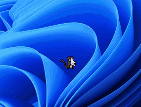
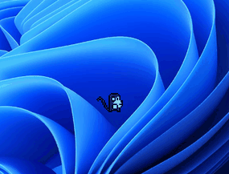
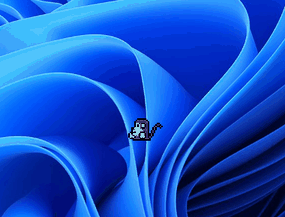
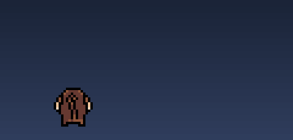
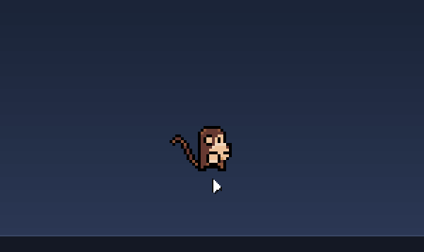

<div align="center">

# 🐒 Desktop Monkey

**A tiny pixel-art monkey that lives on your desktop.**



*Free, open source, no account, no dependencies — Windows & macOS.*

</div>

---

Your cursor is his **best friend**: he follows it around, and when the mouse
sits still too long he gets on with his own life — wandering, climbing,
napping, and leaving the odd surprise on your desktop. Click him and he
complains; click him enough and he keels over (you can revive him).

## What he does

| | |
|:---:|:---:|
| <br>**Follows your cursor** everywhere | <br>**Hunts it down** and whacks it with bananas |
| <br>**Click him** — three hearts, then he keels over | <br>**Climbs the screen edge**, then drops off |
| <br>**Leaves a steaming poop** — click it to pop it | |

To bring a dead monkey back: **grab the body and shake it**. The rest is yours
to discover — naps, small talk, stolen cursors…

## Install

### macOS

```bash
brew install --cask my-monkeys/tap/desktop-monkey
```

Launch **Desktop Monkey** from Spotlight. A monkey icon appears in the menu
bar — *Launch at startup*, *Open settings*, *Quit*. Signed and notarized by
Apple, so it opens without a warning.

### Windows

Download **`monkey.exe`** from the
[latest release](https://github.com/my-monkeys/desktop-monkey/releases/latest)
and double-click it. A monkey icon appears in the notification area with the
same little menu (*Launch at startup*, *Open settings*, *Quit*).

That's it — he has no window, he just lives on the desktop.

## Good to know

- **Languages** — he speaks English, or French if your system is set to
  French. Force it with `"langue": "en"` / `"langue": "fr"` in the settings.
- **Settings** — pick *Open settings* from his menu to edit `config.json`:
  his size (`"taille"`, e.g. `0.8` for smaller or `1.5` for bigger), how
  clingy he is, how often he poops, how many clicks he survives, and more.
- **Uninstall** — `brew uninstall --cask desktop-monkey` on macOS; just delete
  `monkey.exe` on Windows.

## Credits

- Monkey sprites: [Pixel Art Monkey](https://tiki-ted.itch.io/pixel-art-monkey) by tiki-ted
- Heart explosion: [Reactorcore](https://reactorcore.itch.io/explosion-spriteanim-sheet-minipack)

Sprites belong to their authors and aren't covered by the code's MIT license.

<sub>Built in Go, no game engine — the source (in French 🥖) builds with `./build.sh windows` / `./build.sh mac`.</sub>
