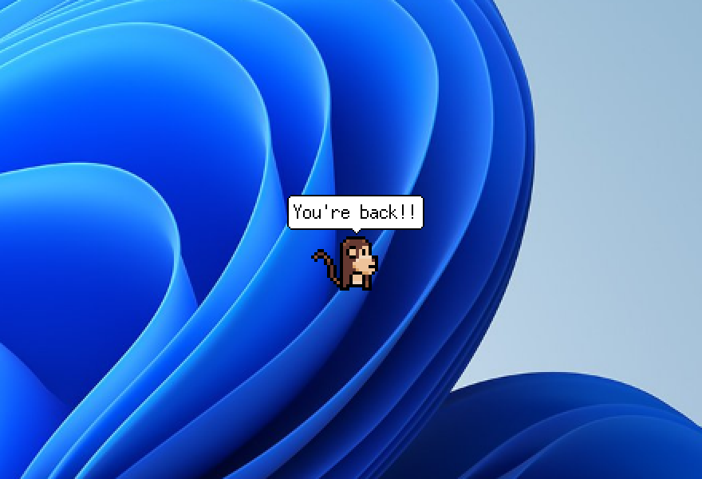

<div align="center">

# 🐒 Desktop Monkey

**A tiny pixel-art monkey that lives on your Windows desktop.**



*A single `.exe`, no installation, no dependencies.*

</div>

---

Your cursor is **his best friend**: as long as it moves once in a while, the
monkey spends most of his time catching up with it and following it around —
and when you grab the mouse again after a long break, he comes running.
Sometimes friendship turns into play: he hunts the arrow down to attack it,
and his paw strikes actually knock it back; he may even **steal your cursor**
and run away with it, returning it when he gets where he's going — or as soon
as you shake the mouse to break free.

When the mouse stops moving for a while, he gets on with his own life:
wandering around, eating, bouncing, climbing the edges of the screen before
letting himself drop, and eventually taking a nap — with the occasional
speech bubble along the way.

## What he does

| | |
|:---:|:---:|
| <br>**Hunts the arrow** and attacks it with bananas — every hit knocks it back | <br>**Steals the cursor** and runs away with it, until you fight back |
| <br>**Takes your clicks**: three hearts, a damage flash, and loud complaints | <br>**Climbs the screen edges**, catches his breath at the top, lets go |
| <br>**Botches his landings** — the fall costs a heart, and he won't climb on his last one | <br>**Bounces around** in real parabolas, rebounding off the screen edges |
| <br>**Dies for real**: the body falls and lies on the taskbar | <br>**Welcomes you back** the moment your mouse comes back to life |

The rest is yours to discover: the nap when you ignore him, the startled
wake-up, time-of-day small talk, the post-resurrection jitters…

### Killing him, reviving him

Three clicks and it's over: a heart explosion, then the body falls onto the
taskbar and lies there. You can drag it around with the mouse — released, it
falls right back down. To bring him back: **grab the body and shake it,
hard**. The power of love does the rest (he'll be skittish for a while
though — don't get too close too fast).

A lost heart comes back on its own after 45 seconds of peace.

## Install

1. Download `monkey.exe` from the
   [Releases](https://github.com/my-monkeys/desktop-monkey/releases).
2. Double-click it. That's all.

To stop him: `Stop-Process -Name monkey` in PowerShell (he has no window and
no tray icon — he *lives* on the desktop, that's the whole point).

### Start automatically with Windows

The app must run inside the user's session. A scheduled task at logon does
the job:

```powershell
$a = New-ScheduledTaskAction -Execute "C:\Path\to\monkey.exe"
$p = New-ScheduledTaskPrincipal -UserId "$env:COMPUTERNAME\$env:USERNAME" -LogonType Interactive
$s = New-ScheduledTaskSettingsSet -AllowStartIfOnBatteries -DontStopIfGoingOnBatteries `
     -ExecutionTimeLimit ([TimeSpan]::Zero) -MultipleInstances IgnoreNew
$t = New-ScheduledTaskTrigger -AtLogOn -User "$env:COMPUTERNAME\$env:USERNAME"
$t.Delay = "PT25S"
Register-ScheduledTask -TaskName "Monkey" -Action $a -Principal $p -Settings $s -Trigger $t
```

`-AllowStartIfOnBatteries` matters on a laptop: without it, Windows queues
the task and never starts it.

## Languages

The monkey speaks **English** by default, and **French** if your Windows is
set to French. You can force either with `"langue": "en"` or `"langue": "fr"`
in the config file below.

## Customizing

On first launch, a configuration file is created at
`%APPDATA%\SingeDeBureau\config.json`:

- `chance_ami`: probability of going to see a still-alive cursor at the end
  of an activity, whatever the distance (default `0.85`).
- `secondes_avant_vie_seule`: seconds of mouse stillness after which he gives
  up on it and lives his own life (default `10`).
- `coeurs`: number of clicks before he dies (default `3`).
- `chance_chasse`: how often a pursuit turns into a hunt (default `0.35`).
  He gives up if the mouse stops moving.
- `chance_vol`: probability that a hunt at close range ends with him
  stealing the cursor (default `0.35`).
- `chance_grimpe`: probability of going to climb a screen edge
  (default `0.12`).
- `cache_apres_clic`: at `0` (default) the dead body falls onto the taskbar;
  set a positive value and he disappears for that many seconds, then comes
  back somewhere else.
- `secondes_avant_resurrection`: with a positive value, a body left on the
  ground that long gets back up on its own (default `0`: only shaking
  revives him).

Plus speed, distances, chattiness, nap timing… it's all in the file.

**Change what he says**: drop a `phrases.json` next to the config — it
replaces the embedded lines, no recompiling. Same format as
[the embedded collection](internal/ressources/assets/phrases.en.json): lists
of lines per context (`bonjour`, `touche`, `chasse`, `abandon`,
`retrouvailles`, `ranime`…).

### Change the character


Sprite sheets are described by a JSON file, never hard-coded. For another
character, drop an image in `internal/ressources/assets/` with its
descriptor next to it:

```json
{
  "image": "singe.png",
  "cellule": [48, 48],
  "echelle": 1.333,
  "vue": "dessus",
  "animations": {
    "marche_bas": {"cellules": [[0,0],[1,0],[2,0],[1,0]], "ms": 130},
    "repos_bas":  {"cellules": [[1,0]], "ms": 400}
  }
}
```

Animation names follow the `action` or `action_direction` convention
(directions `bas`, `gauche`, `droite`, `haut`). Recognized actions: `repos`
(idle), `marche` (walk), `mange` (eat), `dort` (sleep), `meurt` (die),
`touche` (hit), `attaque` (attack), `saute` (jump), `grimpe` (climb),
`tombe` (fall) — **all optional**. Behavior adapts to what the sheet
provides: without an eating animation, the monkey simply never gets hungry;
without a climbing one, he stays on the ground.

`vue` is either `dessus` (four directions, RPG Maker style) or `profil`
(side view, left and right only). `outils/composer_planche.py` normalizes
store-bought sprite packs into a single sheet and writes the descriptor.

## Build from source

```bash
./build.sh windows     # produces dist/singe.exe
./build.sh mac         # produces dist/singe-mac
```

The Windows executable builds from any machine — no cgo. All resources
(images, lines) are embedded in the binary.

Desktop rendering is currently implemented for Windows only
(`internal/calque`). The rest of the program is platform-independent: a
macOS port comes down to a transparent `NSWindow` and reading the cursor.

> **Note** — the source code is written in French (identifiers, comments,
> package names). It's a French monkey. 🥖

## How it works

The app is a small borderless window, absent from the taskbar, always on
top and *click-through*: clicks and keystrokes pass through it as if it
didn't exist. It moves along with the monkey instead of covering the screen,
which keeps it light and harmless.

Click-through is achieved without `WS_EX_TRANSPARENT`: on a layered window,
Windows hit-tests clicks **per pixel**. They pass through where the image is
transparent, and are absorbed where the monkey is drawn. Since the window
receives no usable mouse events in this setup, cursor position and button
state are read straight from the system (`internal/souris`) — which is also
what lets him steal the arrow and knock it around.

```
cmd/singe/          entry point, main loop, scene composition
internal/
  calque/           alpha-channel window laid on the desktop (per platform)
  planche/          sprite sheet loading (JSON-described)
  vie/              behavior: state machine, decisions, movement
  bulle/            speech bubble rendering
  coeurs/           health hearts rendering
  paroles/          picking what he says, per context
  langue/           user language detection
  souris/           global mouse reading (per platform)
  ressources/       embedded images and lines
```

### Why no game engine

Rendering is fully software, into an `image.RGBA` displayed through
`UpdateLayeredWindow`. That's not a default choice: Ebitengine with a
transparent window falls back to OpenGL (and composes an opaque black
background on machines without a usable driver), and DXGI's flip
presentation is incompatible with layered windows. `UpdateLayeredWindow` is
the mechanism Windows actually provides for this: no 3D driver required, it
works even in a GPU-less virtual machine, and the per-pixel alpha channel
gives smooth edges.

To check rendering without opening a window, on any platform:

```bash
go run ./cmd/singe -capture preview.png
```

`outils/` also contains the scripts that build, deploy and drive the mouse
of a Windows test VM to exercise the interactions (clicks, death, shaking)
without human intervention.

## Credits

- Monkey sprites: [Pixel Art Monkey](https://tiki-ted.itch.io/pixel-art-monkey) by tiki-ted
- Alternative top-down sheet: [WhtDragon](https://forums.rpgmakerweb.com/threads/whtdragons-animals-and-running-horses-now-with-more-dragons.53552/)
- Heart explosion: [Reactorcore](https://reactorcore.itch.io/explosion-spriteanim-sheet-minipack)

The sprites belong to their respective authors and are not covered by the
code's MIT license.
